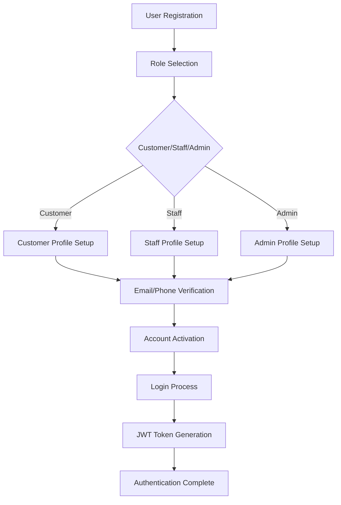
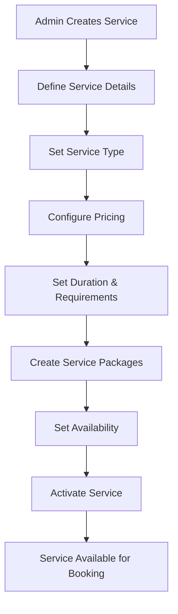
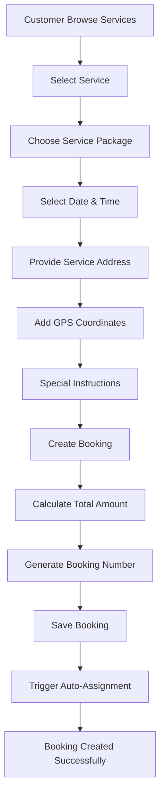
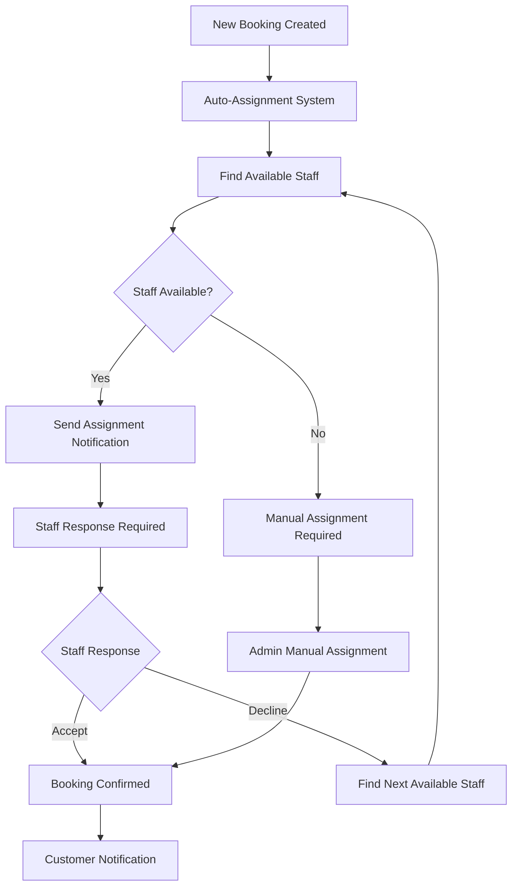
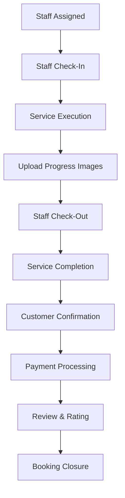
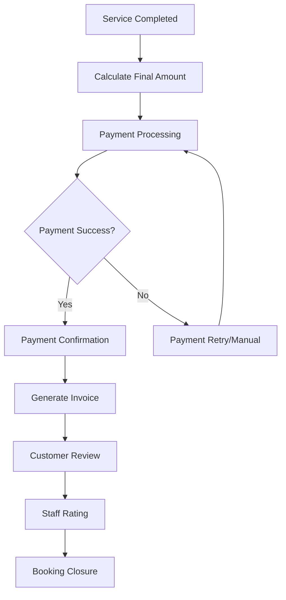
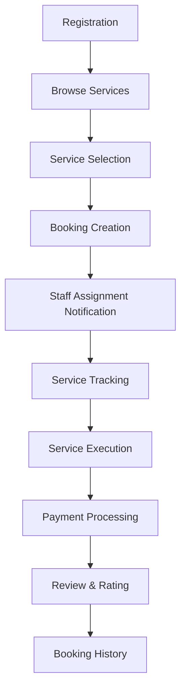
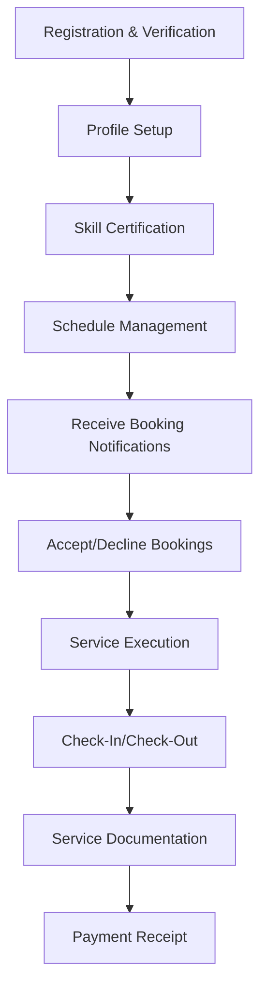
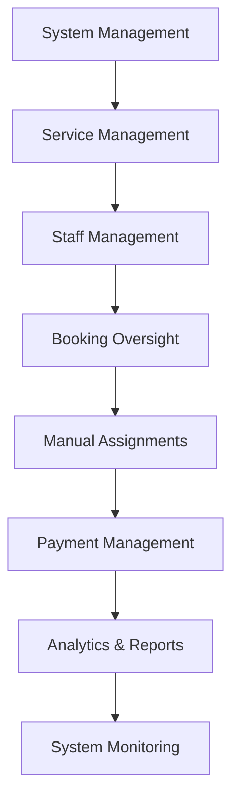
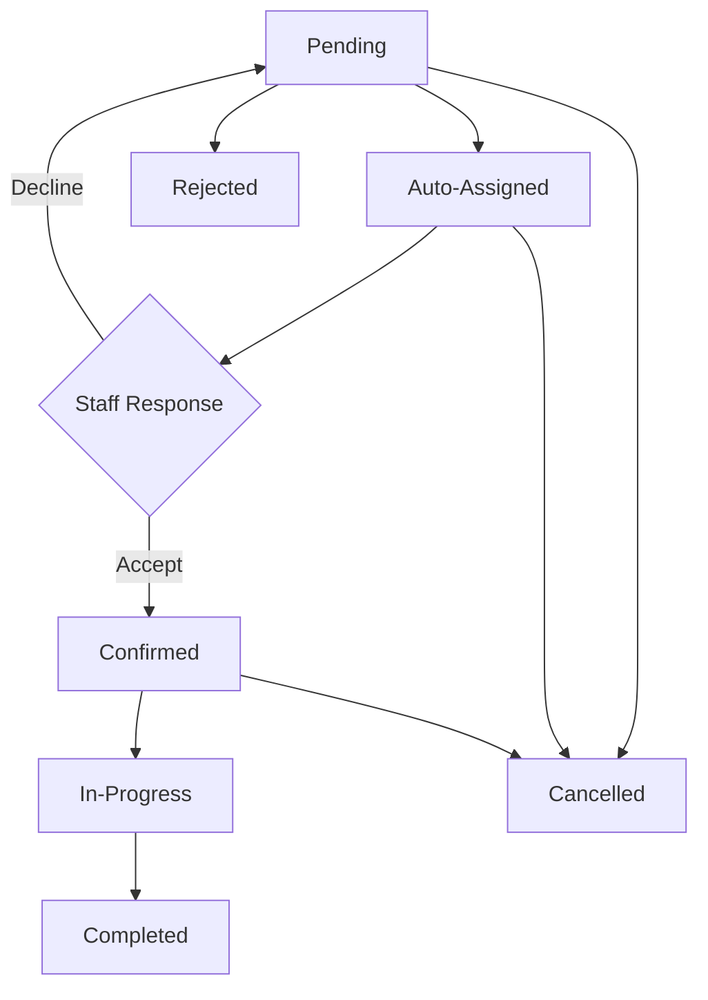

# Mobile Home Service API - Project Flows Documentation

## 📋 Table of Contents
1. [Project Overview](#project-overview)
2. [System Architecture](#system-architecture)
3. [Core Business Flows](#core-business-flows)
4. [User Journey Flows](#user-journey-flows)
5. [API Endpoints Overview](#api-endpoints-overview)
6. [Business Rules & Status Lifecycle](#business-rules--status-lifecycle)
7. [Technical Features](#technical-features)
8. [Database Schema Overview](#database-schema-overview)

---

## 🎯 Project Overview

### **Purpose**
The Mobile Home Service API is a comprehensive backend system designed to facilitate on-demand home services. It serves as the backend for a mobile application that connects customers needing home services with qualified service providers.

### **Main Objectives**
- **Service Marketplace**: Platform for customers to book various home services
- **Staff Management**: System for service providers to manage their work and availability
- **Business Operations**: Administrative tools for managing the entire service ecosystem
- **Payment Processing**: Handle transactions and financial operations
- **Quality Assurance**: Review and rating system for service quality

### **Service Types Available**
- House Cleaning
- Cooking
- Laundry & Ironing
- Gardening
- Babysitting
- Elder Care
- Pet Care
- General Maintenance

---

## 🏗️ System Architecture

### **Layered Architecture**
```
┌─────────────────────────────────────────┐
│           API Layer                     │
│  (MobileHomeServiceApi)                 │
│  - Controllers                          │
│  - Authentication                       │
│  - API Documentation                    │
└─────────────────────────────────────────┘
                    │
┌─────────────────────────────────────────┐
│         Service Layer                   │
│  (MHS.Service)                          │
│  - Business Logic                       │
│  - DTOs                                 │
│  - Service Implementations              │
└─────────────────────────────────────────┘
                    │
┌─────────────────────────────────────────┐
│       Repository Layer                  │
│  (MHS.Repository)                       │
│  - Data Access                          │
│  - Models                               │
│  - Database Context                     │
└─────────────────────────────────────────┘
                    │
┌─────────────────────────────────────────┐
│        Common Layer                     │
│  (MHS.Common)                           │
│  - Shared Enums                         │
│  - Constants                            │
│  - Utilities                            │
└─────────────────────────────────────────┘
```

---

## 🔄 Core Business Flows

### **1. User Registration & Authentication Flow**


### **2. Service Management Flow**


### **3. Customer Booking Flow**


### **4. Staff Assignment Flow**


### **5. Service Execution Flow**


### **6. Payment & Completion Flow**


---

## 👥 User Journey Flows

### **Customer Journey**


**Detailed Steps:**
1. **Registration**: Create account with email/phone verification
2. **Service Discovery**: Browse available services by type and location
3. **Booking Process**: 
   - Select service and optional packages
   - Choose date/time slots
   - Provide detailed address with GPS coordinates
   - Add special instructions
4. **Staff Assignment**: System auto-assigns qualified staff
5. **Service Tracking**: Monitor booking status in real-time
6. **Payment**: Process payment after service completion
7. **Feedback**: Rate and review the service provider

### **Staff Journey**


**Detailed Steps:**
1. **Onboarding**: Registration with skill verification
2. **Profile Setup**: Add services they can provide
3. **Schedule Management**: Set availability and work hours
4. **Booking Management**: 
   - Receive auto-assignment notifications
   - Accept/decline booking requests
   - View upcoming schedules
5. **Service Execution**:
   - Check-in at customer location
   - Perform required services
   - Document work with photos
   - Check-out upon completion
6. **Payment**: Receive compensation for completed services

### **Admin Journey**


**Detailed Steps:**
1. **Service Management**: Create/update/deactivate services
2. **Staff Management**: Onboard staff, verify skills, monitor performance
3. **Booking Oversight**: Monitor all bookings, resolve issues
4. **Manual Assignment**: Assign staff when auto-assignment fails
5. **Payment Management**: Handle payments, refunds, disputes
6. **System Analytics**: Generate reports and monitor KPIs

---

## 🛠️ API Endpoints Overview

### **Authentication Endpoints**
- `POST /api/users/login` - User login
- `POST /api/users/logout` - User logout
- `POST /api/users/refresh-token` - Refresh JWT token
- `POST /api/users/send-email-verification` - Send email verification
- `POST /api/users/verify-otp` - Verify OTP code

### **User Management Endpoints**
- `POST /api/users` - Create new user
- `GET /api/users/{id}` - Get user by ID
- `PUT /api/users/{id}` - Update user profile
- `DELETE /api/users/{id}` - Delete user
- `POST /api/users/change-password` - Change password
- `POST /api/users/forgot-password` - Forgot password
- `POST /api/users/reset-password` - Reset password

### **Service Management Endpoints**
- `GET /api/services` - Get all services (with filtering)
- `GET /api/services/{id}` - Get service by ID
- `POST /api/services` - Create new service (Admin)
- `PUT /api/services/{id}` - Update service (Admin)
- `DELETE /api/services/{id}` - Delete service (Admin)
- `GET /api/services/by-type/{type}` - Get services by type
- `GET /api/services/popular` - Get popular services
- `POST /api/services/{id}/calculate-price` - Calculate service price

### **Booking Management Endpoints**
- `POST /api/bookings` - Create new booking
- `GET /api/bookings/{id}` - Get booking by ID
- `GET /api/bookings` - Get bookings (with filtering)
- `PUT /api/bookings/{id}` - Update booking
- `POST /api/bookings/{id}/cancel` - Cancel booking
- `POST /api/bookings/respond` - Staff respond to booking
- `POST /api/bookings/check-in` - Staff check-in
- `POST /api/bookings/check-out` - Staff check-out
- `GET /api/bookings/available-slots` - Get available time slots
- `POST /api/bookings/{id}/auto-assign` - Auto-assign staff (Admin)
- `POST /api/bookings/{id}/manual-assign/{staffId}` - Manual assign staff (Admin)

---

## 📊 Business Rules & Status Lifecycle

### **Booking Status Lifecycle**


### **User Roles & Permissions**
| Role | Permissions |
|------|-------------|
| **Customer** | Book services, make payments, leave reviews, manage profile |
| **Staff** | Accept bookings, execute services, manage schedule, upload completion photos |
| **Admin** | Full system management, create services, manage staff, force complete bookings |
| **Manager** | Operational oversight, staff assignment, service management |
| **System** | Automated processes, notifications, assignments |

### **Payment Methods Supported**
- Cash
- Credit/Debit Cards
- Bank Transfer
- E-Wallet
- QR Code payments

---

## 🔧 Technical Features

### **Authentication & Security**
- JWT-based authentication with role-based authorization
- ASP.NET Identity for user management
- Password policies and email verification
- Refresh token mechanism

### **Database & ORM**
- Entity Framework Core with SQL Server
- Repository pattern with Unit of Work
- Soft delete implementation
- Audit fields (CreatedAt, UpdatedAt)

### **API Documentation**
- Swagger/OpenAPI integration
- Comprehensive endpoint documentation
- Request/response examples

### **Logging & Monitoring**
- Serilog for structured logging
- Comprehensive error handling
- Request/response logging

### **Performance & Scalability**
- Memory caching for frequently accessed data
- Pagination for large datasets
- Async/await patterns throughout

### **Real-time Features**
- **Geo-location**: GPS-based staff assignment and tracking
- **Notifications**: Real-time updates for booking status changes
- **Availability**: Dynamic time slot management
- **Auto-assignment**: Intelligent staff matching algorithm

---

## 🗄️ Database Schema Overview

### **Core Entities**
```
Users (Identity)
├── Customers
├── Staff
└── Admins

Services
├── ServicePackages
└── StaffSkills

Bookings
├── BookingImages
├── Payments
├── Reviews
└── StaffReports

Notifications
WorkSchedules
CustomerAddresses
CustomerPaymentMethods
```

### **Key Relationships**
- **One-to-One**: User ↔ Customer/Staff/Admin
- **One-to-Many**: Service → ServicePackages
- **Many-to-Many**: Staff ↔ Services (via StaffSkills)
- **One-to-Many**: Booking → BookingImages
- **One-to-One**: Booking ↔ Payment
- **One-to-One**: Booking ↔ Review

---

## 🚀 Getting Started

### **Prerequisites**
- .NET 6 or later
- SQL Server
- Visual Studio or VS Code

### **Configuration**
1. Update `appsettings.json` with your database connection string
2. Configure JWT settings
3. Set up email/SMS providers for notifications

### **Running the Application**
```bash
# Build the solution
dotnet build

# Run database migrations
dotnet ef database update

# Start the application
dotnet run --project MobileHomeServiceApi
```

### **API Documentation**
Access Swagger UI at: `https://localhost:5001/swagger`

---

## 📈 Business Model

The system operates as a **service marketplace** where:
- Customers pay for services through the platform
- Staff receive payment for completed services
- The platform takes a commission from each transaction
- Quality is maintained through reviews and ratings

### **Revenue Streams**
1. **Commission**: Percentage of each transaction
2. **Subscription**: Premium features for staff
3. **Advertising**: Promoted services
4. **Service Fees**: Booking and payment processing fees

---

## 🔮 Future Enhancements

### **Planned Features**
- **Real-time Chat**: Communication between customers and staff
- **Video Calls**: Remote consultation capabilities
- **AI Scheduling**: Machine learning for optimal staff assignment
- **IoT Integration**: Smart home device integration
- **Multi-language Support**: Localization for different markets
- **Advanced Analytics**: Business intelligence dashboard
- **Mobile Push Notifications**: Real-time mobile alerts
- **Loyalty Program**: Customer retention features

### **Scalability Considerations**
- **Microservices Architecture**: Break down into smaller services
- **Event-Driven Architecture**: Implement event sourcing
- **Caching Strategy**: Redis for distributed caching
- **Load Balancing**: Multiple API instances
- **Database Sharding**: Horizontal scaling

---

*This documentation provides a comprehensive overview of the Mobile Home Service API project flows and architecture. For technical implementation details, refer to the source code and inline documentation.* 