# Mobile Home Service API - Project Flows Documentation

## 📋 Table of Contents
1. [Project Overview](#project-overview)
2. [System Architecture](#system-architecture)
3. [Core Business Flows](#core-business-flows)
4. [User Journey Flows](#user-journey-flows)
5. [API Endpoints Overview](#api-endpoints-overview)
6. [Business Rules & Status Lifecycle](#business-rules--status-lifecycle)
7. [Technical Features](#technical-features)
8. [Database Schema Overview](#database-schema-overview)

---

## 🎯 Project Overview

### **Purpose**
The Mobile Home Service API is a comprehensive backend system designed for a **home service company** to manage their operations. It serves as the backend for a mobile application that allows customers to book services from the company's employed staff.

### **Main Objectives**
- **Service Management**: System for customers to book various home services from the company
- **Employee Management**: Tools for managing company staff schedules and assignments
- **Business Operations**: Administrative tools for managing company operations and finances
- **Payment Processing**: Handle customer payments directly to the company
- **Quality Assurance**: Review and rating system to maintain service quality standards

### **Service Types Available**
- House Cleaning
- Cooking
- Laundry & Ironing
- Gardening
- Babysitting
- Elder Care
- Pet Care
- General Maintenance

---

## 🏗️ System Architecture

### **Layered Architecture**
```
┌─────────────────────────────────────────┐
│           API Layer                     │
│  (MobileHomeServiceApi)                 │
│  - Controllers                          │
│  - Authentication                       │
│  - API Documentation                    │
└─────────────────────────────────────────┘
                    │
┌─────────────────────────────────────────┐
│         Service Layer                   │
│  (MHS.Service)                          │
│  - Business Logic                       │
│  - DTOs                                 │
│  - Service Implementations              │
└─────────────────────────────────────────┘
                    │
┌─────────────────────────────────────────┐
│       Repository Layer                  │
│  (MHS.Repository)                       │
│  - Data Access                          │
│  - Models                               │
│  - Database Context                     │
└─────────────────────────────────────────┘
                    │
┌─────────────────────────────────────────┐
│        Common Layer                     │
│  (MHS.Common)                           │
│  - Shared Enums                         │
│  - Constants                            │
│  - Utilities                            │
└─────────────────────────────────────────┘
```

---

## 🔄 Core Business Flows

### **1. User Registration & Authentication Flow**


### **2. Service Management Flow**


**Detailed Steps:**
1. **Service Creation**: Admin accesses service management panel
2. **Basic Information**:
   - Enter service name and description
   - Select service type (HouseCleaning, Cooking, etc.)
   - Upload service image/icon
3. **Pricing Configuration**:
   - Set base price for the service
   - Configure hourly rate (if applicable)
   - Define estimated duration in minutes
4. **Requirements & Restrictions**:
   - List equipment/materials needed
   - Specify any restrictions or limitations
   - Set special requirements for customers
5. **Service Package Creation**:
   - Create Basic package with standard features
   - Create Premium package with additional services
   - Set different pricing and duration for each package
6. **Availability Settings**:
   - Define service areas/regions
   - Set operational hours
   - Configure staff requirements
7. **Activation**: 
   - Review all configurations
   - Activate service for customer booking
   - Service appears in mobile app catalog

### **3. Customer Booking Flow**


### **4. Staff Assignment Flow**


**Detailed Steps:**
1. **Trigger Auto-Assignment**: System activates when booking status = Pending
2. **Staff Filtering Criteria**:
   - Match required service skills
   - Check availability on booking date/time
   - Verify geographic proximity to service location
   - Consider staff rating and experience level
3. **Priority Algorithm**:
   - Distance from service location (closest first)
   - Staff rating and customer reviews
   - Number of completed jobs
   - Last assignment time (load balancing)
4. **Notification Process**:
   - Send push notification to selected staff
   - Include booking details and location
   - Set response deadline (typically 15-30 minutes)
   - Update booking status to "AutoAssigned"
5. **Staff Response Handling**:
   - **Accept**: Update booking to "Confirmed", notify customer
   - **Decline**: Log reason, find next available staff
   - **No Response**: Auto-decline after deadline, find next staff
6. **Fallback to Manual Assignment**:
   - If no staff available, notify admin
   - Admin can manually assign or reschedule
   - System sends manual assignment notification
7. **Confirmation**:
   - Update booking status and timestamps
   - Send confirmation to customer with staff details
   - Add booking to staff's schedule

### **5. Service Execution Flow**


**Detailed Steps:**
1. **Pre-Service Preparation**:
   - Staff receives confirmed booking notification
   - Review service requirements and customer instructions
   - Prepare necessary equipment and materials
   - Travel to customer location
2. **Check-In Process**:
   - Staff arrives at service location
   - Verify GPS location matches booking address
   - Take "arrival" photo for documentation
   - Update booking status to "InProgress"
   - Record actual start time
3. **Service Execution**:
   - Review service requirements with customer
   - Clarify any special instructions
   - Begin service work according to package specifications
   - Follow safety protocols and quality standards
4. **Progress Documentation**:
   - Take before/during/after photos
   - Upload images to booking record
   - Add notes about work performed
   - Document any issues or changes
5. **Service Completion**:
   - Complete all tasks in service package
   - Clean up work area
   - Review completed work with customer
   - Address any customer concerns
6. **Check-Out Process**:
   - Take final completion photos
   - Record actual end time
   - Get customer approval/signature (if required)
   - Update booking status to "Completed"
7. **Post-Service**:
   - System calculates final amount
   - Generate service completion report
   - Trigger payment processing
   - Send completion notification to customer

### **6. Payment & Completion Flow**


**Detailed Steps:**
1. **Amount Calculation**:
   - Start with base service package price
   - Add any extra time charges (if service exceeded estimated duration)
   - Apply any additional service fees
   - Calculate platform commission
   - Apply discounts or promotions (if applicable)
2. **Payment Method Selection**:
   - Present customer with saved payment methods
   - Allow selection of new payment method
   - Support: Cash, Card, Bank Transfer, E-Wallet, QR Code
3. **Payment Processing**:
   - **Cash**: Staff collects payment, marks as paid
   - **Electronic**: Process through payment gateway
   - Generate unique transaction ID
   - Update payment status in real-time
4. **Payment Verification**:
   - **Success**: Confirm payment received
   - **Failure**: Retry mechanism with different method
   - **Pending**: Monitor gateway response
5. **Invoice Generation**:
   - Create detailed invoice with service breakdown
   - Include staff details and service completion photos
   - Generate PDF invoice for customer records
   - Send via email and in-app notification
6. **Review & Rating Process**:
   - Prompt customer to rate service (1-5 stars)
   - Collect detailed ratings (Quality, Timeliness, Professionalism, Communication)
   - Allow written feedback and comments
   - Optional: Upload photos of completed work
7. **Staff Compensation**:
   - Calculate staff payment (service fee - platform commission)
   - Update staff earnings and completed job count
   - Process payment to staff account
8. **Booking Finalization**:
   - Archive booking as completed
   - Update customer loyalty points
   - Send completion summary to all parties
   - Generate analytics data for reporting

---

## 👥 User Journey Flows

### **Customer Journey**


**Detailed Steps:**
1. **Registration**: Create account with email/phone verification
2. **Service Discovery**: Browse available services by type and location
3. **Booking Process**: 
   - Select service and optional packages
   - Choose date/time slots
   - Provide detailed address with GPS coordinates
   - Add special instructions
4. **Staff Assignment**: System auto-assigns qualified staff
5. **Service Tracking**: Monitor booking status in real-time
6. **Payment**: Process payment after service completion
7. **Feedback**: Rate and review the service provider

### **Employee Journey**


**Detailed Steps:**
1. **Hiring Process**: Company recruitment and background verification
2. **Employee Onboarding**: Setup company profile and access credentials
3. **Training & Certification**: Company-provided training on service standards
4. **Schedule Management**: Assigned work hours and availability by managers
5. **Work Assignment**: 
   - Receive assigned bookings from management
   - View daily/weekly work schedules
   - Get customer and service details
6. **Service Execution**:
   - Check-in at customer location using company app
   - Perform services according to company standards
   - Document work with photos and notes
   - Check-out upon completion
7. **Compensation**: Receive regular salary/hourly wages from company

### **Management Journey**


**Detailed Steps:**
1. **Service Management**: Create/update company service offerings and pricing
2. **Employee Management**: Hire employees, manage schedules, monitor performance
3. **Booking Oversight**: Monitor all customer bookings and service delivery
4. **Employee Assignment**: Assign employees to bookings based on skills and availability
5. **Financial Management**: Track company revenue, costs, and employee compensation
6. **Business Analytics**: Generate reports on revenue, employee performance, and customer satisfaction

---

## 👥 Use Cases by Role

### **🧑‍💼 Customer Use Cases**

**Authentication & Profile Management**
- Register new customer account
- Login/logout from mobile app
- Update personal profile information
- Change password
- Reset forgotten password
- Manage saved addresses (home, office, etc.)
- Set up and manage payment methods
- View and update emergency contact information

**Service Discovery & Booking**
- Browse available home services
- Filter services by type, price, availability
- View service details and pricing packages
- Select service packages (Basic, Premium, etc.)
- Choose appointment date and time slots
- Select or add new service address
- Add special instructions for service
- Review booking summary and total cost
- Confirm booking and make payment

**Booking Management**
- View current upcoming bookings
- View booking history and past services
- Track real-time booking status
- Receive notifications about booking updates
- Cancel bookings (with refund policies)
- Reschedule existing bookings
- Add notes or update special instructions
- Contact assigned employee through app

**Payment & Billing**
- Make payments for completed services
- View payment history and invoices
- Process refunds for cancelled services
- Update payment methods
- Apply discount codes or promotions
- Set up automatic payment for recurring services
- View billing statements and receipts

**Service Tracking & Communication**
- Track employee arrival and service progress
- Receive real-time service status updates
- View employee profile and ratings
- Communicate with employee during service
- Approve overtime charges if service runs long
- Confirm service completion
- Report issues or complaints

**Reviews & Feedback**
- Rate completed services (1-5 stars)
- Provide detailed reviews (quality, timeliness, professionalism)
- Write comments and feedback
- View past reviews given
- Report service quality issues
- Recommend services to others

**Loyalty & Rewards**
- View loyalty points balance
- Redeem loyalty points for discounts
- Access customer loyalty programs
- Receive special offers and promotions
- View service usage statistics

---

### **👷 Employee Use Cases**

**Authentication & Profile**
- Login to employee mobile app
- Update personal contact information
- Change password and security settings
- View employee ID and company information

**Schedule Management**
- View daily work schedule
- View weekly/monthly work calendar
- Check assigned bookings and appointments
- View customer details for each booking

**Booking & Assignment Management**
- Receive work assignments from managers
- View detailed booking information
- Access customer contact details
- Read special instructions from customers
- Check service location and GPS directions
- Notify if unable to complete assigned work

**Service Execution**
- Check-in at customer location (GPS verification)
- Take before/during/after photos
- Handle customer requests during service
- Check-out when service is complete

**Customer Interaction**
- Communicate with customers through app
- Collect cash payments if needed
- Explain services performed to customer
- Get customer sign-off on completed work

---

### **👔 Manager/Admin Use Cases**

**Employee Management**
- CRUD new Staff
**Service & Operations Management**
- Create and configure new services
- Set pricing for services and packages
- Manage service availability and capacity
- Configure service areas and coverage zones
- Set business hours and holiday schedules
- Manage equipment and supply inventory
- Create service quality standards
- Monitor operational efficiency metrics

**Booking & Assignment Management**
- Monitor all customer bookings in real-time
- Manually assign employees to bookings
- Handle booking conflicts and scheduling issues
- Approve or reject overtime requests
- Manage emergency scheduling and replacements
- Optimize route planning for employees
- Handle urgent or priority bookings
- Manage booking cancellations and rescheduling

**Customer Service Management**
- Handle customer complaints and issues
- Process refund requests
- Manage customer escalations
- Monitor customer satisfaction ratings
- Respond to customer feedback
- Manage customer loyalty programs
- Handle billing disputes
- Approve special pricing or discounts

**Financial Management**
- Monitor daily/monthly revenue
- Track service profitability
- Manage pricing strategies
- Process employee payroll
- Handle refunds and payment disputes
- Generate financial reports
- Monitor operational costs
- Set budget targets and forecasts

**Quality Control & Compliance**
- Monitor service quality metrics
- Conduct quality audits
- Implement quality improvement processes
- Ensure compliance with regulations
- Manage customer feedback and reviews
- Train employees on quality standards
- Handle service failures and corrections
- Maintain service quality certifications

**Analytics & Reporting**
- Generate business performance reports
- Monitor key performance indicators (KPIs)
- Analyze customer satisfaction trends
- Track employee productivity metrics
- Monitor financial performance
- Generate operational efficiency reports
- Analyze service demand patterns
- Create executive dashboards

**System Administration**
- Manage user accounts and permissions
- Configure system settings and parameters
- Monitor system performance and uptime
- Manage data backups and security
- Handle system integrations
- Manage mobile app configurations
- Monitor API usage and performance
- Handle system maintenance and updates

---

### **🤖 System Automated Use Cases**

**Booking Automation**
- Auto-assign employees to bookings based on skills/availability
- Send booking confirmation notifications
- Generate booking numbers and references
- Calculate service pricing and taxes
- Send reminder notifications before appointments
- Auto-escalate unassigned bookings to managers
- Process booking modifications and updates

**Payment Processing**
- Process customer payments automatically
- Handle payment gateway integrations
- Generate invoices and receipts
- Process refunds and cancellations
- Calculate loyalty points and rewards
- Send payment confirmation notifications
- Handle failed payment retries

**Notification Management**
- Send push notifications for booking updates
- Email confirmations and reminders
- SMS notifications for urgent updates
- Send service completion notifications
- Alert managers of system issues
- Notify employees of new assignments
- Send promotional messages and offers

**Data Management & Analytics**
- Collect and store service performance data
- Generate automated reports
- Monitor system performance metrics
- Backup data automatically
- Sync data across mobile and web platforms
- Archive completed bookings
- Generate business intelligence insights

**Schedule Optimization**
- Optimize employee routes and schedules
- Suggest best assignment matches
- Calculate travel times and distances
- Balance workload across employees
- Identify scheduling conflicts
- Suggest schedule improvements
- Handle daylight saving time adjustments

**Quality Monitoring**
- Track service completion times
- Monitor customer satisfaction scores
- Alert managers of quality issues
- Generate quality performance reports
- Track employee performance metrics
- Monitor service standard compliance
---

## 🛠️ API Endpoints Overview

### **Authentication Endpoints**
- `POST /api/users/login` - User login
- `POST /api/users/logout` - User logout
- `POST /api/users/refresh-token` - Refresh JWT token
- `POST /api/users/send-email-verification` - Send email verification
- `POST /api/users/verify-otp` - Verify OTP code

### **User Management Endpoints**
- `POST /api/users` - Create new user
- `GET /api/users/{id}` - Get user by ID
- `PUT /api/users/{id}` - Update user profile
- `DELETE /api/users/{id}` - Delete user
- `POST /api/users/change-password` - Change password
- `POST /api/users/forgot-password` - Forgot password
- `POST /api/users/reset-password` - Reset password

### **Service Management Endpoints**
- `GET /api/services` - Get all services (with filtering)
- `GET /api/services/{id}` - Get service by ID
- `POST /api/services` - Create new service (Admin)
- `PUT /api/services/{id}` - Update service (Admin)
- `DELETE /api/services/{id}` - Delete service (Admin)
- `GET /api/services/by-type/{type}` - Get services by type
- `GET /api/services/popular` - Get popular services
- `POST /api/services/{id}/calculate-price` - Calculate service price

### **Booking Management Endpoints**
- `POST /api/bookings` - Create new booking
- `GET /api/bookings/{id}` - Get booking by ID
- `GET /api/bookings` - Get bookings (with filtering)
- `PUT /api/bookings/{id}` - Update booking
- `POST /api/bookings/{id}/cancel` - Cancel booking
- `POST /api/bookings/respond` - Staff respond to booking
- `POST /api/bookings/check-in` - Staff check-in
- `POST /api/bookings/check-out` - Staff check-out
- `GET /api/bookings/available-slots` - Get available time slots
- `POST /api/bookings/{id}/auto-assign` - Auto-assign staff (Admin)
- `POST /api/bookings/{id}/manual-assign/{staffId}` - Manual assign staff (Admin)

---

## 📊 Business Rules & Status Lifecycle

### **Booking Status Lifecycle**


### **User Roles & Permissions**
| Role | Permissions |
|------|-------------|
| **Customer** | Book services, make payments, leave reviews, manage profile |
| **Staff** | Accept bookings, execute services, manage schedule, upload completion photos |
| **Admin** | Full system management, create services, manage staff, force complete bookings |
| **Manager** | Operational oversight, staff assignment, service management |
| **System** | Automated processes, notifications, assignments |

### **Payment Methods Supported**
- Cash
- Credit/Debit Cards
- Bank Transfer
- E-Wallet
- QR Code payments

---

## 🔧 Technical Features

### **Authentication & Security**
- JWT-based authentication with role-based authorization
- ASP.NET Identity for user management
- Password policies and email verification
- Refresh token mechanism

### **Database & ORM**
- Entity Framework Core with SQL Server
- Repository pattern with Unit of Work
- Soft delete implementation
- Audit fields (CreatedAt, UpdatedAt)

### **API Documentation**
- Swagger/OpenAPI integration
- Comprehensive endpoint documentation
- Request/response examples

### **Logging & Monitoring**
- Serilog for structured logging
- Comprehensive error handling
- Request/response logging

### **Performance & Scalability**
- Memory caching for frequently accessed data
- Pagination for large datasets
- Async/await patterns throughout

### **Real-time Features**
- **Geo-location**: GPS-based staff assignment and tracking
- **Notifications**: Real-time updates for booking status changes
- **Availability**: Dynamic time slot management
- **Auto-assignment**: Intelligent staff matching algorithm

---

## 🏠 Service vs Service Package Explained

### **Service (Main Category)**
A **Service** represents the **main category** of work that can be performed. Think of it as the broad service offering:

```
🧹 House Cleaning Service
├── BasePrice: $50.00
├── HourlyRate: $25.00  
├── EstimatedDuration: 180 minutes
├── Requirements: "Access to cleaning supplies, water, electricity"
└── Restrictions: "No hazardous materials"
```

**Service Properties:**
- **Name & Description**: What the service is about
- **ServiceType**: Enum categorization (HouseCleaning, Cooking, etc.)
- **BasePrice**: Starting price for the service
- **HourlyRate**: Additional hourly charges (optional)
- **EstimatedDuration**: Expected time to complete
- **Requirements**: What customer needs to provide
- **Restrictions**: Service limitations

### **Service Packages (Specific Offerings)**
**Service Packages** are **specific offerings** within each service category, providing different levels of service:

```
🧹 House Cleaning Service
├── 📦 Basic Package
│   ├── Name: "House Cleaning - Basic Package"
│   ├── Price: $50.00
│   ├── Duration: 180 minutes
│   └── Included: "Dusting, vacuuming, mopping"
│
├── 📦 Premium Package
│   ├── Name: "House Cleaning - Premium Package" 
│   ├── Price: $75.00
│   ├── Duration: 240 minutes
│   └── Included: "Basic + windows, oven, refrigerator"
│
└── 📦 Deep Clean Package
    ├── Name: "House Cleaning - Deep Clean Package"
    ├── Price: $100.00
    ├── Duration: 300 minutes
    └── Included: "Premium + carpet cleaning, garage"
```

**ServicePackage Properties:**
- **Name & Description**: Specific package details
- **Price**: Fixed price for this package
- **DurationMinutes**: Expected completion time
- **IncludedItems**: What's included in this package
- **SortOrder**: Display order in app

### **Real-World Examples:**

**🧹 House Cleaning Service:**
- Basic Package ($50, 3h): Dusting, vacuuming, mopping
- Premium Package ($75, 4h): Basic + windows + appliances  
- Deep Clean Package ($100, 5h): Premium + carpets + garage

**👨‍🍳 Cooking Service:**
- Meal Prep Basic ($40, 2h): 3 meals prepared
- Dinner Party ($80, 4h): 3-course meal + table service
- Weekly Meal Plan ($120, 6h): 7 days worth of meals

**🧺 Laundry Service:**
- Quick Wash ($20, 1h): Wash + dry + fold
- Premium Care ($30, 1.5h): Delicate handling + ironing
- Bulk Service ($40, 2h): Large loads + pickup/delivery

### **Booking Relationship:**
```
Customer Booking Process:
1. Browse Services → Select "House Cleaning"
2. Choose Package → Select "Premium Package ($75)"
3. Book Service → Creates booking with ServiceId + ServicePackageId
4. Payment → Uses ServicePackage.Price as base amount
```

---

## 💰 Money Flow & Business Revenue Model

### **📊 Company Service Pricing Structure**

As a **home service company** with employed staff, the pricing calculation follows this structure:

```typescript
// Example: House Cleaning Premium Package
Booking Calculation:
├── Base Package Price: $75.00
├── Overtime Charges: $25.00/hour (if exceeds estimated time)
├── Service Fees: Included in package price
├── Taxes: Calculated based on location
└── Total Amount: Base + Overtime + Taxes
```

**Amount Fields in Booking:**
- **TotalAmount**: Initial calculated price when booking is created
- **FinalAmount**: Final price after service completion (includes overtime, adjustments)

### **🔄 Complete Money Flow (Company Business Model)**

```mermaid
graph TD
    A["👤 Customer<br/>Books Service Package<br/>$75"] --> B["💳 Payment Processing<br/>Company Receives $75"]
    B --> C{"Payment Method"}
    C -->|Cash| D["💵 Cash Payment<br/>Staff Collects for Company"]
    C -->|Electronic| E["🏦 Payment Gateway<br/>Direct to Company Account"]
    
    D --> F["✅ Payment Confirmed<br/>Company Revenue: $75"]
    E --> F
    
    F --> G["🏢 Company Revenue<br/>100% = $75.00"]
    G --> H["📊 Business Operations"]
    
    H --> I["👷 Staff Salaries<br/>Fixed Monthly/Hourly Wages"]
    H --> J["🛠️ Equipment & Supplies<br/>Company Provides All Materials"]
    H --> K["🚗 Transportation<br/>Vehicle Costs & Fuel"]
    H --> L["📱 System Operations<br/>Technology & Support"]
    H --> M["📈 Business Profit<br/>After All Expenses"]
    
    N["❌ Refund Scenarios"] --> O["🔄 Company Refund<br/>Full Company Loss"]
    O --> P["👤 Customer Refund<br/>From Company Funds"]
```



### **📈 Company Revenue Model**

**Revenue Structure (Traditional Service Business):**
| Component | Amount (on $75) | Description |
|-----------|-----------------|-------------|
| **Gross Revenue** | $75.00 | Total customer payment to company |
| **Staff Wages** | $20.00 | Fixed hourly wage (e.g., $20/hour for 1 staff) |
| **Materials & Supplies** | $8.00 | Cleaning supplies, equipment depreciation |
| **Transportation** | $7.00 | Vehicle costs, fuel, maintenance |
| **System Operations** | $5.00 | App maintenance, admin costs |
| **Insurance & Benefits** | $10.00 | Staff insurance, worker compensation |
| **Net Profit** | $25.00 | Company profit margin (33%) |

**Company Revenue Streams:**
1. **Service Revenue**: 100% of all customer payments
2. **Package Premiums**: Higher margins on premium service packages
3. **Add-on Services**: Additional services during appointments
4. **Subscription Plans**: Regular customer service contracts
5. **Corporate Contracts**: B2B cleaning contracts

### **💳 Payment Methods & Processing**

**Supported Payment Methods:**
```csharp
public enum PaymentMethod
{
    Cash = 1,           // Staff collects cash for company
    CreditCard = 2,     // Visa, Mastercard via gateway
    DebitCard = 3,      // Direct bank debit
    BankTransfer = 4,   // Online banking transfer
    EWallet = 5,        // MoMo, ZaloPay, GrabPay
    QRCode = 6          // QR-based instant payments
}
```

**Payment Processing Flow:**
1. **Pre-Authorization**: Hold amount when booking is confirmed
2. **Service Delivery**: Company staff provides service
3. **Payment Capture**: Full amount goes to company account
4. **Financial Recording**: Update company books and staff performance metrics

### **🔄 Refund & Cancellation Policies**

**Cancellation Timeline:**

```mermaid
graph TD
    A["📋 Booking Created<br/>$75 Pre-authorized"] --> B{"Cancellation Time"}
    
    B -->|"24+ hours before"| C["💯 Full Refund<br/>$75 to customer<br/>Company absorbs cost"]
    B -->|"2-24 hours before"| D["🔗 50% Refund<br/>$37.50 to customer<br/>Company keeps $37.50"]
    B -->|"Less than 2 hours"| E["❌ No Refund<br/>Company keeps full $75"]
    B -->|"Service started"| F["❌ No Refund<br/>Company keeps full amount"]
    
    G["🚨 Service Quality Issues"] --> H["📞 Customer Complaint"]
    H --> I["🔍 Manager Investigation"]
    I --> J{"Resolution Decision"}
    J -->|"Employee Error"| K["💯 Full Refund + Employee Training"]
    J -->|"System Issue"| L["🔗 Partial Refund + Process Improvement"]
    J -->|"Customer Error"| M["❌ No Refund"]
```


**Refund Processing:**
```csharp
Payment Refund Fields:
├── RefundAmount: Amount being refunded
├── RefundReason: Reason for refund
├── RefundedAt: Timestamp of refund
└── RefundMethod: How refund is processed
```

### **💼 Business Scenarios**

**Scenario A: Standard Successful Service**
```
1. Customer books "Premium House Cleaning" → $75 company revenue
2. Employee arrives and completes service in 4 hours → Paid hourly wage
3. Service completed successfully → $75 to company account
4. Costs: Staff wage $20 + supplies $8 + overhead $22 = $50
5. Company profit: $25 (33% margin) → Service cycle complete
```

**Scenario B: Service with Overtime**
```
1. Customer books "Basic House Cleaning" → $50 (3 hours estimated)
2. Service requires 4 hours → 1 hour overtime charge to customer
3. Manager approves overtime billing → Customer pays additional $25
4. Final revenue: $75 ($50 base + $25 overtime) to company
5. Employee gets regular wage + overtime pay per company policy
```

**Scenario C: Last-Minute Cancellation**
```
1. Customer books service → $75 pre-authorized to company
2. Customer cancels 1 hour before service → 50% refund policy
3. Company refunds: $37.50 back to customer
4. Company keeps: $37.50 (covers staff scheduling costs)
5. Employee may still get paid for scheduled time per company policy
```

**Scenario D: Service Quality Issue**
```
1. Service completed but customer unsatisfied → Complaint to company
2. Manager reviews evidence (photos, employee report, customer feedback)
3. Decision: Employee error → Full refund + employee retraining
4. Company refunds: $75 back to customer (company absorbs loss)
5. Employee consequence: Additional training, performance review
```

### **📊 Financial Tracking & Reporting**

**Payment Record Structure:**
```csharp
Payment Entity:
├── PaymentNumber: "PAY202312250001"        // Unique payment identifier
├── BookingId: Links to specific booking
├── Amount: $75.00                          // Total payment amount
├── Method: PaymentMethod.CreditCard        // How customer paid
├── Status: PaymentStatus.Paid              // Current payment status
├── TransactionId: "TXN12345678"           // Internal transaction ID
├── GatewayTransactionId: "GTW87654321"    // Payment gateway reference
├── PaidAt: DateTime                       // When payment was processed
├── RefundAmount: $0.00                    // Any refunded amount
└── Notes: "Payment for Booking BK001"     // Additional information
```

**Financial Analytics:**
- **Daily Revenue**: Total company earnings by service type and region
- **Employee Performance**: Individual productivity, ratings, and job completion rates
- **Profit Margin Analysis**: Service profitability and pricing optimization
- **Payment Method Trends**: Customer preferences and processing costs
- **Refund Analysis**: Patterns and reasons for refunds
- **Operational Costs**: Employee wages, supplies, overhead vs. revenue

### **🔐 Financial Security & Compliance**

**Security Measures:**
- **PCI DSS Compliance**: Secure handling of card payment data
- **Data Encryption**: All financial data encrypted in transit and at rest
- **Fraud Detection**: AI-powered algorithms to detect suspicious transactions
- **Two-Factor Authentication**: Additional security for high-value transactions
- **Audit Trails**: Complete transaction history for compliance

**Regulatory Compliance:**
- **Tax Reporting**: Automatic tax calculation and reporting
- **Anti-Money Laundering**: KYC verification for staff and high-value customers
- **Consumer Protection**: Clear refund policies and dispute resolution
- **Financial Licensing**: Compliance with local financial service regulations

### **💡 Key Benefits**

**For Customers:**
✅ Transparent pricing with no hidden fees  
✅ Multiple payment options for convenience  
✅ Clear refund policies and protection  
✅ Secure payment processing  

**For Employees:**
✅ Stable salary/hourly wages regardless of booking volume  
✅ Company-provided equipment and supplies  
✅ Regular work schedule and benefits  
✅ Training and career development opportunities  

**For Company:**
✅ Direct customer relationships and revenue control  
✅ Scalable business model with employed workforce  
✅ Quality control through employee management  
✅ Comprehensive financial tracking and reporting  

This business model ensures **operational control**, **quality consistency**, and **sustainable growth** for the home service company.

---

## 🗄️ Database Schema Overview

### **Core Entities**
```
Users (Identity)
├── Customers
├── Staff
└── Admins

Services
├── ServicePackages
└── StaffSkills

Bookings
├── BookingImages
├── Payments
├── Reviews
└── StaffReports

Notifications
WorkSchedules
CustomerAddresses
CustomerPaymentMethods
```

### **Key Relationships**
- **One-to-One**: User ↔ Customer/Staff/Admin
- **One-to-Many**: Service → ServicePackages
- **Many-to-Many**: Staff ↔ Services (via StaffSkills)
- **One-to-Many**: Booking → BookingImages
- **One-to-One**: Booking ↔ Payment
- **One-to-One**: Booking ↔ Review

---

## 🚀 Getting Started

### **Prerequisites**
- .NET 6 or later
- SQL Server
- Visual Studio or VS Code

### **Configuration**
1. Update `appsettings.json` with your database connection string
2. Configure JWT settings
3. Set up email/SMS providers for notifications

### **Running the Application**
```bash
# Build the solution
dotnet build

# Run database migrations
Pick Repository as target project
Add-Migration {name}
Update-Database

# Start the application
dotnet run --project MobileHomeServiceApi
```

### **API Documentation**
Access Swagger UI at: `https://localhost:5001/swagger`

---

---


---

*This documentation provides a comprehensive overview of the Mobile Home Service API project flows and architecture. For technical implementation details, refer to the source code and inline documentation.* 